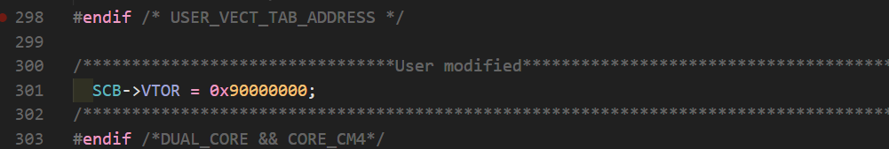

# STM32F1,F4,H7_HAL_Template

本项目是基于HAL库，适用于STM32F1,F4,H7平台的项目模版，主要特征如下：

- 使用vscode作为代码编辑器

- 使用clangd作为代码提示，高亮，跳转等

- 使用CMake管理项目的编译链接，生成elf,hex,bin文件，用于烧录和Debug

- 使用OpenOCD进行二进制文件的烧录和Debug

- 使用arm-none-eabi-gcc进行代码的编译

- 对于H7平台，支持片外下载和片外调试(QSPI Flash内的程序)

- 使用bootloader+application的实现H7的片外程序的加载

  
  
    

具体的安装流程如下

1. 下载需要的工具和软件等

    1. 安装vscode [点击此处](https://code.visualstudio.com/)
    2. 下载OpenOCD[点击此处](https://github.com/openocd-org/openocd/releases)
    3. 下载arm-none-eabi-gcc[点击此处](https://github.com/xpack-dev-tools/arm-none-eabi-gcc-xpack/releases)
    4. 下载CMake[点击此处](https://cmake.org/download/)
    5. 下载clang[点击此处](https://github.com/llvm/llvm-project/releases)

2. 安装工具

    1. 将上述下载的工具安装到合适的位置，注意路径不要出现中文
    2. 将OpenOCD的bin文件夹，arm-none-eabi-gcc的bin文件夹，CMake的bin文件夹以及clang的bin文件夹添加到系统环境变量
    3. 使用命令行测试各个工具是否安装完毕

3. 配置vscode

    1. 安装需要的插件

        这里列出推荐安装的vscode插件:clangd,CMake, Language Support,Cortex-Debug,Doxygen,indent-colorizer,C/C++

    2. 配置插件

        1. 配置clangd

            打开设置，搜索clangd,找到Clangd:Path输入安装好的clangd.exe的路径，如果已添加到系统变量，可以直接输入clangd,clangd:Arguments添加如下几项

            --header-insertion=never

            --clang-tidy

            --background-index

            --pch-storage=disk	

            更改 .clangd 文件中的系统包含目录为arm-none-eabi-gcc的包含目录

        2. 配置OpenOCD
        
            将文件夹下的000_openocd_cfg文件夹下的scripts文件夹复制到安装好的OpenOCD对应的scripts文件夹进行替换
        
    3. 对于H7平台的片外程序加载支持
    
        需要在H7的内部FLASH刷入bootloader,再修改一下中断向量地址以及连接文件即可编译出适合运行在外部flash中的程序
    
        

​			

​	

